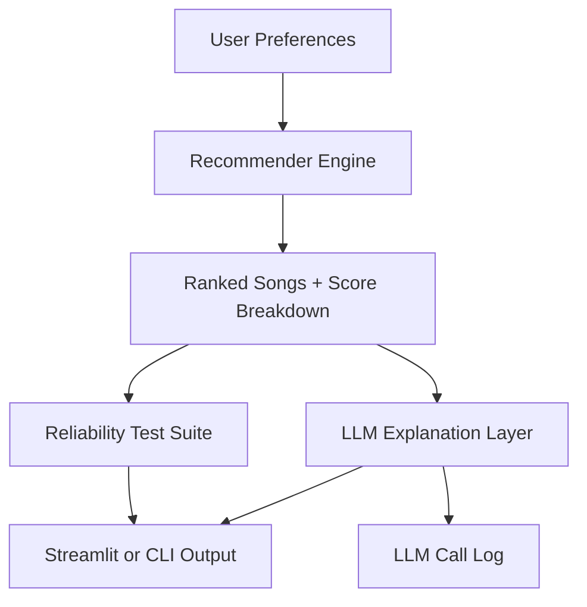

# Music Recommender Simulation Plus LLM Explanations

## Title and Summary

This project is an upgraded version of **Module/Project 3: Music Recommender Simulation**. The original goal in Module 3 was to model songs and user preferences as structured data, score songs with a transparent weighted rule, and return top recommendations with clear reasoning. It could personalize music picks from a small catalog, but explanations were rule-based only and reliability checks were limited.

In this final version, I kept the transparent recommender core and added a full AI layer with retrieval-augmented explanations, robustness testing, and an interactive Streamlit UI. This matters because it moves the project from a classroom scoring demo to a more complete applied AI system that can explain outputs, surface failure modes, and support iterative debugging.

## Architecture Overview

The system diagram represents a pipeline with two outputs from the same recommendation core.

1. User preferences are scored against each song with weighted feature matching.
2. Ranked songs and feature metadata are sent to an LLM client (Mock, Claude, or Gemini) to generate readable explanations.
3. The same recommendation outputs are also fed into reliability tools for consistency, sensitivity, adversarial, and bias checks.
4. Both the explanations and robustness metrics are shown in Streamlit (or CLI) with call logging for traceability.



## Setup Instructions

1. Open a terminal and move into the project folder.

```bash
cd applied-ai-system-final
```

2. Create and activate a virtual environment.

```bash
python -m venv .venv

# macOS or Linux
source .venv/bin/activate

# Windows PowerShell
.venv\Scripts\Activate.ps1
```

3. Install dependencies.

```bash
pip install -r requirements.txt
```

4. Optional: configure API keys for live LLM explanations.

```bash
copy .env.example .env
```

Then set keys in `.env`:

```env
ANTHROPIC_API_KEY=your_anthropic_key_here
GEMINI_API_KEY=your_gemini_key_here
```

If keys are missing, the app still works in Mock mode.

5. Run the app.

```bash
streamlit run src/app.py
```

Optional CLI run:

```bash
python src/main.py
```

Optional script for profile comparison:

```bash
python assets/scripts/experiment_compare.py
```

Optional stretch feature: evaluation harness with pass/fail summary.

```bash
python assets/scripts/evaluation_harness.py
```

This prints a summary to the terminal and saves a machine-readable report to `assets/results/evaluation_harness_report.json`.

## Sample Interactions

Below are real-style examples of system behavior using the current scoring logic and LLM explanation flow.

### Example 1: Pop + Happy + High Energy

**Input**

```text
genre=pop
mood=happy
energy=0.82
likes_acoustic=False
popularity_target=75
decade=2010
```

**System Output (Top recommendation + AI explanation)**

```text
Song: Sunrise City
Score: 7.82
AI Explanation:
"Sunrise City ranks first because it strongly matches your pop and happy preferences,
and its high energy profile is close to your target. Its lower acousticness also fits
your preference for less acoustic tracks, so it becomes a strong overall match."
```

### Example 2: Rock + Intense + Very Low Energy (adversarial)

**Input**

```text
genre=rock
mood=intense
energy=-1.20
likes_acoustic=True
```

**System Output (Top recommendation + robustness insight)**

```text
Song: Storm Runner
Score: 7.10
AI Explanation:
"Storm Runner still ranks highly due to exact rock and intense category matches,
which carry larger weights than numeric distance penalties."

Robustness Note:
"Out-of-range energy values do not crash the system, but they can flatten numeric scoring
and increase dependence on categorical features."
```

### Example 3: Unknown Labels + Numeric Only

**Input**

```text
genre=nonexistent-genre
mood=nonexistent-mood
energy=0.55
likes_acoustic=True
```

**System Output (Top recommendation + AI explanation)**

```text
Song: Sunset Caravan
Score: 2.95
AI Explanation:
"No direct genre or mood match was found, so ranking leaned on energy and acousticness.
Sunset Caravan stayed closest to those numeric preferences across the catalog."
```

## Design Decisions

I made five core design choices.

1. **Weighted, transparent scoring before LLM output**
   This keeps recommendation logic auditable. Trade-off: simpler logic can miss subtle taste patterns.

2. **Pluggable LLM clients (Mock, Claude, Gemini)**
   This supports offline development and API flexibility. Trade-off: response style varies by backend.

3. **RAG-style explanation generation from structured metadata**
   The model explains with grounded inputs instead of free-form hallucination. Trade-off: explanation quality depends on metadata quality.

4. **Reliability suite integrated into the app UI**
   This makes testing part of normal use, not an afterthought. Trade-off: adds complexity to app state and execution flow.

5. **Dual interfaces (Streamlit + CLI)**
   Streamlit is best for demos and interaction, CLI is better for quick scripted checks. Trade-off: two interfaces require duplicate maintenance.

## Testing Summary

### Reliability Measurement Methods Used

1. **Automated checks**
   - `pytest -q` for unit coverage of key recommender behaviors.
   - Custom reliability functions for deterministic consistency and perturbation sensitivity.

2. **Logging and error handling**
   - LLM calls are logged with backend choice, timestamps, and fallback behavior.
   - Adversarial profile execution records pass/fail status and error details without crashing the app.

3. **Human evaluation**
   - Manual review of recommendation quality in Streamlit by comparing user intent against top-ranked songs and generated explanations.

### What Worked

- Core recommendation ranking remained deterministic for repeated identical inputs.
- Mock mode allowed full feature testing without API credentials.
- Adversarial profiles executed without crashing the pipeline.
- LLM call logging captured backend, timestamp, and fallback behavior for debugging.

### What Did Not Work Well

- Case-sensitive categorical matching can miss valid user intent (`Pop` vs `pop`).
- Out-of-range numeric inputs can produce unintuitive ranking behavior.
- Small catalog size can create repetitive top results across different profiles.

### What I Learned from Testing

- Reliability is not only about avoiding crashes. It is also about output stability and fairness under imperfect inputs.
- Structured adversarial tests reveal issues that normal happy-path testing will miss.
- Explanation quality improves when the recommender output includes detailed score components.

### Quick Results Snapshot

- Automated unit tests: **blocked at collection** due to a `src` import-path mismatch in `tests/test_recommender.py` under the current environment (0 tests executed).
- Reliability checks: **5 out of 5 adversarial profiles succeeded** without runtime failure.
- Consistency score: **1.00** across 10 repeated runs with identical input.
- Sensitivity: average top-5 ranking change was about **0.20** for both energy perturbation and acousticness flip.
- Biggest struggle: behavior is less intuitive when user context is malformed (for example, case-mismatched categories or out-of-range numeric values).

### Test Harness or Evaluation Script (Stretch Feature)

I added `assets/scripts/evaluation_harness.py` to run predefined profiles and produce measurable evaluation output.

What it measures:

1. Pass/fail validation for each predefined profile.
2. Confidence score per profile based on top score strength and rank margin.
3. Reliability gate checks (consistency threshold and adversarial success).
4. LLM explanation availability in mock mode.

Latest run summary:

- **4/4 checks passed**.
- **Average confidence: 0.550**.
- Profile confidence range: **0.264 to 0.817**.
- Report saved to `assets/results/evaluation_harness_report.json`.

## Reflection

### What are the limitations or biases in this system?

The biggest limitation is catalog size and feature scope. With a small song dataset and strong category weights, the model can over-favor certain genres or repeatedly surface similar songs. Another bias risk is input formatting sensitivity, where values like `Pop` versus `pop` can change outcomes in ways that do not reflect true user intent.

### Could this AI be misused, and how would I prevent that?

Yes. A user could submit malformed preferences to force odd recommendations or misuse generated explanations as if they were objective truths. To reduce this, I use input validation, adversarial profile checks, and logging so failures are traceable. I also keep explanations grounded in explicit score components so the output is interpretable instead of presented as unquestionable authority.

### What surprised me while testing reliability?

I expected most issues to be runtime crashes, but the bigger problems were silent quality failures. The system often stayed technically stable while still producing less intuitive rankings under case mismatches or out-of-range values. That shifted my focus from only "does it run" to "does it stay trustworthy under messy input."

### How did I collaborate with AI during this project?

AI was most useful as a fast engineering partner for refactors and documentation structure. One helpful suggestion was using file-relative `Path(__file__).resolve().parents[n]` logic plus direct-execution import bootstrapping, which fixed multiple broken paths after the folder restructure. One flawed suggestion was an earlier replacement attempt that missed a critical import rename in the Streamlit app, leaving `OpenAIClient` in one import line and breaking full Claude migration until I manually corrected it.

## Related Documents

- Model card: [assets/docs/model_card.md](assets/docs/model_card.md)
- Original reflection notes: [assets/docs/reflection.md](assets/docs/reflection.md)


