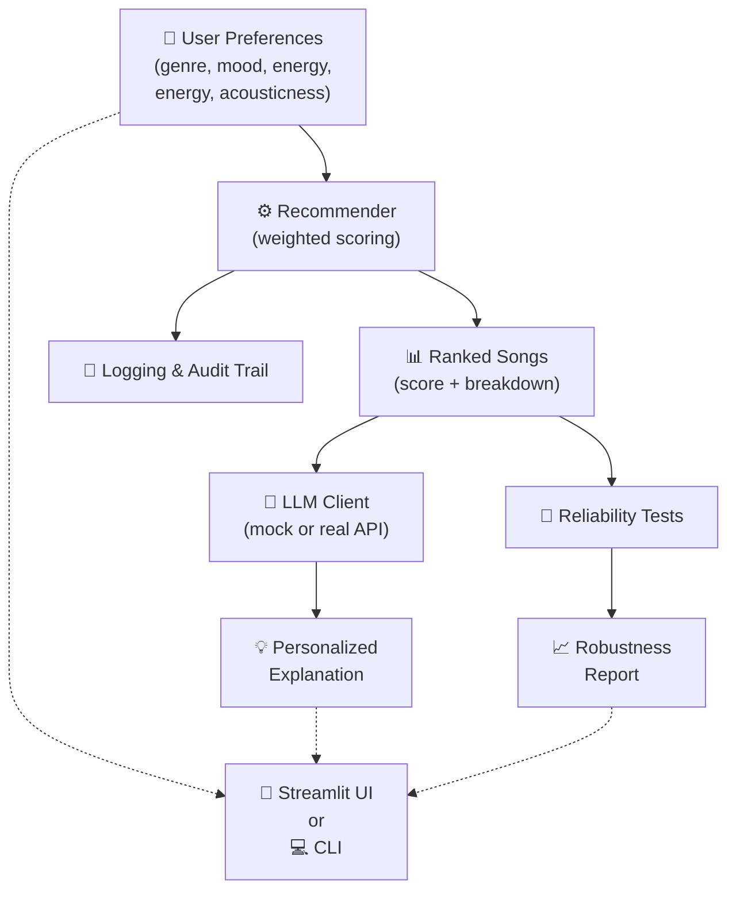

# 🎵 Music Recommender Simulation

## Project Summary

In this project you will build and explain a small music recommender system.

Your goal is to:

- Represent songs and a user "taste profile" as data
- Design a scoring rule that turns that data into recommendations
- Evaluate what your system gets right and wrong
- Reflect on how this mirrors real world AI recommenders

This version builds a transparent music recommender with **LLM-powered explanations** and **robustness testing**:
- **Core Algorithm**: Weighted feature matching (genre, mood, energy, acousticness, popularity, decade preference)
- **AI Feature (RAG)**: LLM retrieves song metadata and generates personalized natural-language explanations
- **Reliability System**: Adversarial testing, consistency checks, sensitivity analysis, and bias detection
- **Interfaces**: Both CLI (pure Python) and interactive Streamlit UI

---

## 🏗️ System Architecture

The system integrates four main components:



### Component Details

| Component | Role | Technology |
|-----------|------|-----------|
| **Recommender** | Scores songs using weighted features | Pure Python |
| **LLM Client** | Generates explanations via API or mock | OpenAI / Gemini / MockClient |
| **Reliability System** | Tests consistency, sensitivity, bias | Custom testing suite |
| **UI Layer** | User interaction & visualization | Streamlit (or CLI) |
| **Logging** | Audit trail for LLM calls & decisions | Python logging |

---

## How The System Works

Explain your design in plain language.

Some prompts to answer:

- What features does each `Song` use in your system
  - For example: genre, mood, energy, tempo
- What information does your `UserProfile` store
- How does your `Recommender` compute a score for each song
- How do you choose which songs to recommend

You can include a simple diagram or bullet list if helpful.

*Joshua P. Response:*
Real-world recommendation systems often combine collaborative signals, content metadata, and user context. This classroom simulation focuses on content-based personalization by matching a user's taste profile to song attributes in a small catalog.

For this specific implementation, these are the core features:

- `Song` features: `genre`, `mood`, `energy`, `tempo_bpm`, `valence`, `danceability`, `acousticness`
- `UserProfile` features: `favorite_genre`, `favorite_mood`, `target_energy`, `likes_acoustic`

### Plan

1. Build a taste profile with both categorical preferences (genre, mood) and numeric preferences (target energy, acoustic preference).
2. Score each song independently using a weighted rule.
3. Keep an explanation of why each song scored the way it did.
4. Sort all songs by total score in descending order.
5. Return the top `k` songs as recommendations.

### Finalized Algorithmic Recipe

For each song, compute:

- `+4.0` points if `song.genre == user.favorite_genre`
- `+3.0` points if `song.mood == user.favorite_mood`
- `+2.5 * (1 - abs(song.energy - user.target_energy))`
- `+1.0 * (1 - abs(song.acousticness - preferred_acousticness))`

Where `preferred_acousticness = 1.0` if `likes_acoustic=True`, otherwise `0.0`.

This creates a clear priority order: genre match first, mood match second, and numeric closeness as tie-breakers.

Here is the taste profile dictionary the recommender uses for comparisons:

```python
taste_profile = {
  "genre": "pop",
  "mood": "happy",
  "energy": 0.8,
  "likes_acoustic": False,
}
```

### Potential Biases To Expect

- Catalog bias: the dataset is small, so underrepresented genres and moods are less likely to appear in top results.
- Preference lock-in: strong genre and mood weights can repeatedly surface similar songs and reduce variety.
- Feature bias: songs are judged by a limited set of metadata features, not lyrics, culture, language, or evolving context.

This flowchart shows how one song moves through the recommender:

```mermaid
flowchart TD
  A[Input: User Prefs\n(taste profile)] --> B[Load songs.csv]
  B --> C[Read next song row]
  C --> D[Create a Song record]
  D --> E[Score one song\nCompare genre, mood, and numeric features]
  E --> F[Add scored song\nto candidate list]
  F --> G{More songs left?}
  G -- Yes --> C
  G -- No --> H[Sort candidate list\nfrom highest score to lowest]
  H --> I[Output: Top K Recommendations]
```

The important idea is that the recommender evaluates one song at a time, saves each scored song in a list, and only ranks the list after the full CSV has been processed.

Additional visualization:


---

## Getting Started

### Prerequisites

- Python 3.9+
- pip

### Setup

1. **Clone and navigate to the project:**

   ```bash
   cd applied-ai-system-final
   ```

2. **Create a virtual environment (recommended):**

   ```bash
   python -m venv .venv
   
   # Activate (Mac/Linux):
   source .venv/bin/activate
   
   # Activate (Windows):
   .venv\Scripts\activate
   ```

3. **Install dependencies:**

   ```bash
   pip install -r requirements.txt
   ```

4. **(Optional) Set up LLM API keys for powered explanations:**

   Copy `.env.example` to `.env` and fill in your API keys:

   ```bash
   cp .env.example .env
   ```

   Then edit `.env`:
   ```
   OPENAI_API_KEY=your_key_here      # For OpenAI-powered explanations
   GEMINI_API_KEY=your_key_here      # For Gemini-powered explanations
   ```

   **Note:** If you skip this, the app will use MockClient (offline mode) with templated explanations.

### Running the App

**Option 1: Interactive Streamlit UI (Recommended)**

```bash
streamlit run src/app.py
```

Then open your browser to `http://localhost:8501`

Features:
- ✅ Adjust preferences in real-time
- ✅ View AI-generated explanations
- ✅ Run robustness & bias tests
- ✅ Toggle between mock/real LLM
- ✅ View LLM call logs (debug)

**Option 2: CLI Interface**

```bash
python src/main.py
```

Shows top 5 recommendations for a pre-configured user profile with detailed scoring breakdowns.

**Option 3: Test Comparison**

```bash
python assets/scripts/experiment_compare.py
```

Generates recommendations for multiple user profiles and compares rankings.

### Running Tests

Run the test suite:

```bash
pytest
```

Run reliability & robustness tests:

```bash
pytest tests/test_recommender.py -v
```

---

## 🤖 AI Features

### 1. **LLM-Powered Explanations (RAG)**

The system uses **Retrieval-Augmented Generation** to explain recommendations:

- **Retrieval**: Fetches song metadata (genre, mood, energy, acousticness, release year)
- **LLM Processing**: Sends retrieved data + user preferences to an LLM
- **Generation**: LLM produces natural-language explanation of *why* each song matches

**Example:**
```
User: Loves pop, happy mood, high energy
LLM Output: "Sunrise City is a perfect match because it's a 2010s pop track 
with a happy vibe and high energy (0.82). Its lower acousticness also aligns 
with your preference for less acoustic songs."
```

**Supported Backends:**
- MockClient (offline, no API key needed)
- OpenAI GPT-4o-mini
- Google Gemini 2.0 Flash

### 2. **Reliability & Robustness Testing**

Built-in test suite to verify system behavior:

#### Consistency Tests
- **What**: Run the same recommendation 10 times, check if output is identical
- **Result**: Consistency score (1.0 = always consistent, 0.0 = random)

#### Sensitivity Analysis
- **What**: Perturb inputs (energy ±10%, flip acoustic preference) and measure ranking changes
- **Result**: % of top-5 songs that change after small input tweaks
- **Purpose**: Detect brittle behavior or over-sensitivity

#### Adversarial Profiles
- **What**: Test edge cases (case sensitivity, out-of-range values, unknown labels, sparse profiles)
- **Result**: Pass/fail for each edge case
- **Purpose**: Ensure robust error handling

#### Bias Detection
- **What**: Measure how often each genre appears in top-5 across many profiles
- **Result**: Genre frequency distribution
- **Purpose**: Identify if system favors certain genres

---

## Experiments You Tried

I ran adversarial and edge-case user profiles to test whether the scoring logic could be tricked or produce unexpected results.

### 1) Case-Sensitivity Attack
Input: genre=Pop, mood=HAPPY, energy=0.90, likes_acoustic=False

Top 5:
- Storm Runner (3.38)
- Gym Hero (3.38)
- Neon Bazaar (3.31)
- Thunder Forge (3.29)
- Midnight Groove (3.14)


### 2) Out-of-Range Energy High
Input: genre=pop, mood=happy, energy=2.50, likes_acoustic=False

Top 5:
- Sunrise City (7.82)
- Gym Hero (4.95)
- Rooftop Lights (3.65)
- Thunder Forge (0.97)
- Baseline Bounce (0.91)


### 3) Out-of-Range Energy Low
Input: genre=rock, mood=intense, energy=-1.20, likes_acoustic=True

Top 5:
- Storm Runner (7.10)
- Gym Hero (3.05)
- Paper Lantern Waltz (0.96)
- Spacewalk Thoughts (0.92)
- Coffee Shop Stories (0.89)


### 4) Unknown Labels + Numeric Only
Input: genre=nonexistent-genre, mood=nonexistent-mood, energy=0.55, likes_acoustic=True

Top 5:
- Sunset Caravan (2.95)
- Coffee Shop Stories (2.94)
- Focus Flow (2.91)
- Velvet Rain (2.90)
- Midnight Coding (2.88)


### 5) Sparse Profile (No Genre/Mood)
Input: energy=0.80, likes_acoustic=False

Top 5:
- Baseline Bounce (3.39)
- Sunrise City (3.27)
- Midnight Groove (3.25)
- Neon Bazaar (3.16)
- Night Drive Loop (3.16)


Key behavior observed:
- Category matching is case-sensitive, so capitalized inputs can bypass genre/mood match boosts.
- Out-of-range numeric preferences still run and can flatten numeric scoring.
- Unknown or missing genre/mood values cause the model to rely mostly on energy and acousticness.

---

## Limitations and Risks

This recommender is explainable and useful for learning, but it has important limits:

- Small-catalog limitation: with only 20 songs, similar tracks can repeat across many profiles.
- Metadata limitation: it does not model lyrics, language, cultural context, or listening history.
- Weighting bias: exact genre/mood matches can over-dominate and narrow variety.
- Input fragility: case-sensitive labels and out-of-range numeric values can produce brittle behavior.

---

## Reflection

Read and complete `model_card.md`:

[**Model Card**](assets/docs/model_card.md)

Write 1 to 2 paragraphs here about what you learned:

- about how recommenders turn data into predictions
- about where bias or unfairness could show up in systems like this

Building this simulation made the data-to-prediction pipeline feel concrete: user preferences become numeric targets, songs become feature vectors, and ranking comes from weighted comparisons. Even with a simple algorithm, the recommendations still feel personalized because small differences in feature alignment accumulate into meaningful score gaps.

The biggest fairness lesson is that "simple" does not mean "neutral." Choices like exact string matching, small and imbalanced catalogs, and high category weights can quietly privilege some users and disadvantage others. Testing adversarial profiles helped expose those failure modes and showed why validation, normalization, and diversity-aware ranking matter in real systems.


---

