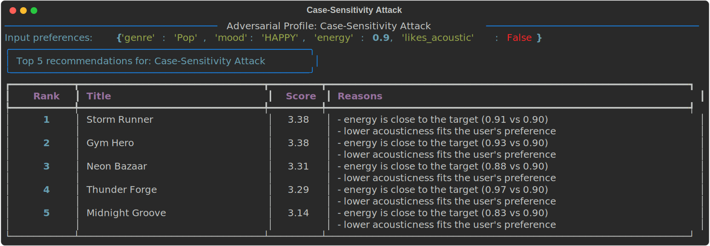
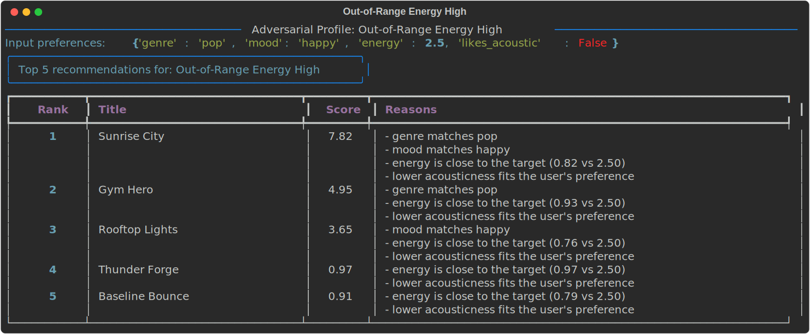
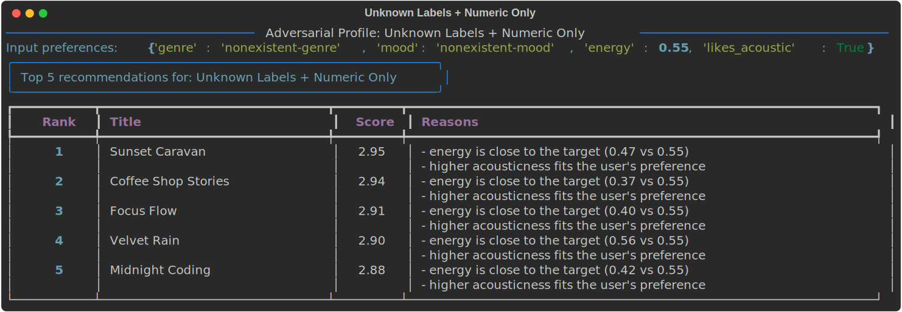

## Adversarial and Edge-Case Profile Runs

These profiles were designed to stress-test the scoring logic and surface unexpected behavior.

### 1) Case-Sensitivity Attack
Input: genre=Pop, mood=HAPPY, energy=0.90, likes_acoustic=False

### 2) Out-of-Range Energy High
Input: genre=pop, mood=happy, energy=2.50, likes_acoustic=False

### 3) Out-of-Range Energy Low
Input: genre=rock, mood=intense, energy=-1.20, likes_acoustic=True

### 4) Unknown Labels + Numeric Only
Input: genre=nonexistent-genre, mood=nonexistent-mood, energy=0.55, likes_acoustic=True

### 5) Sparse Profile (No Genre/Mood)
Input: energy=0.80, likes_acoustic=False

